# RM2022 工程机器人

​	在Robomaster2022赛季中，该工程机器人作为华北科技学院风暴战队的主力机器人之一，在赛场上主要职能为获取"经济"、战场救援、辅助攻击等，为团队竞赛立下了无数汗马功劳。机器人由以下几部分组成： 

1. 云台：这是一个由YAW轴与PITCH轴组成的两轴云台，云台上搭载了主控板与图传数传模块，控制上采用MPU9250的输出信号与电机编码器值作为反馈实现云台的位置-速度双闭环PID控制。

2. 底盘：机器人底盘采用的是AGV舵轮结构，完整底盘相比于普通麦克纳姆轮底盘而言增加了4个舵向电机用于控制机器人的转向，为实现底盘的全向移动功能，在开发过程中，引入了AGV全向移动算法，通过建立底盘坐标系，对底盘进行逆运动学解算，再分别经PID单、双环控制输出。 

3. 伸展变形机构：机器人可以通过伸展变形完成获取与兑换"矿石"（可转换为经济的立方体物块）、救援其他机器人、移动场上道具等动作。该机构由若干轨道、气缸、电机、传感器及其他组件组成，在控制上通过操作IO、中断及定时器等共同实现机器人的核心功能。 

4. 矿石储存仓：储存仓可以上升与下降，在不同的功能下处于不同的状态以配合其他机构完成作业。

   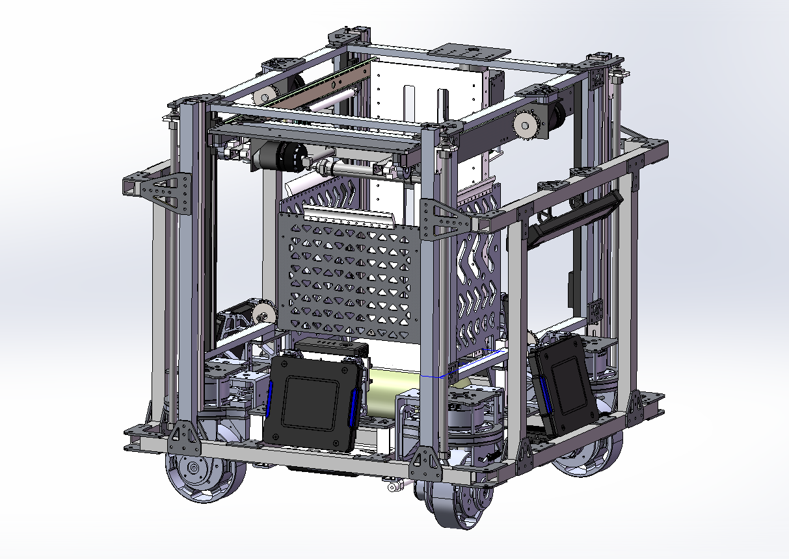

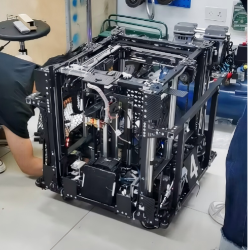

## 1. 项目需求

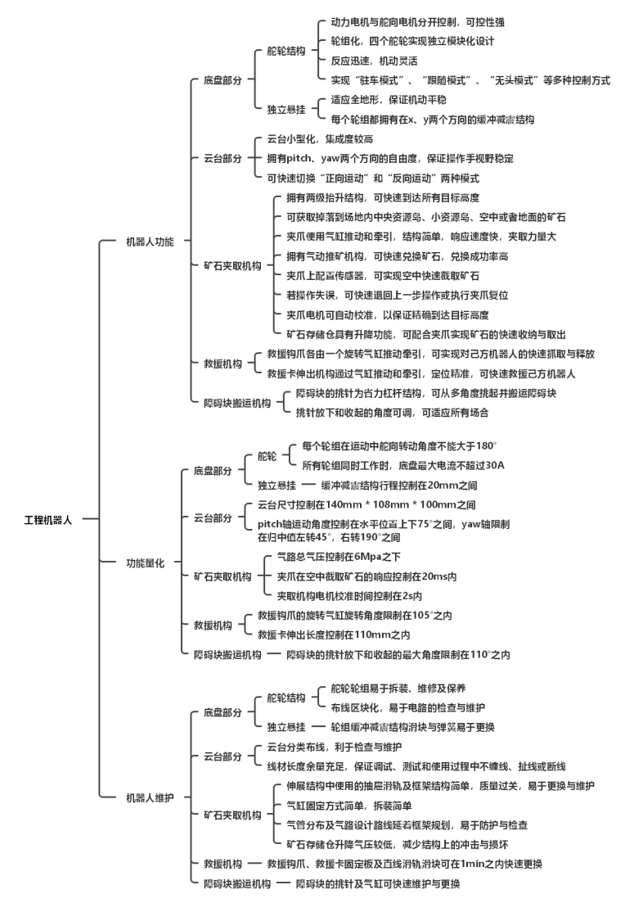

## 2. 机械部分

### 2.1 底盘

#### 2.1.1 AGV 舵轮结构底盘

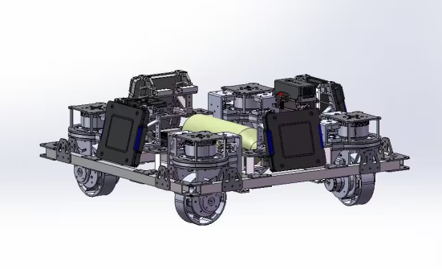

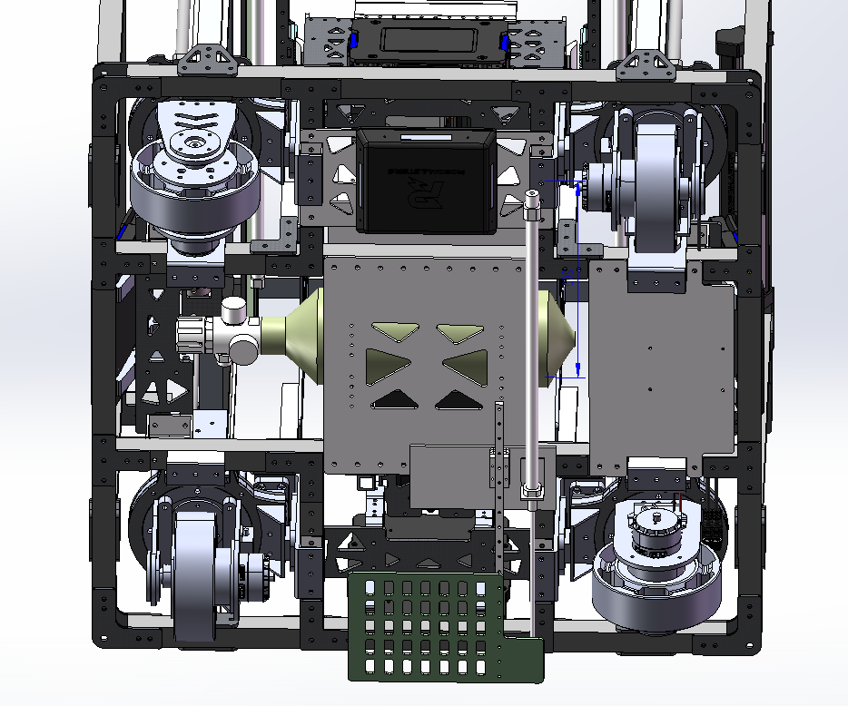

​	底盘采用 6 根中空铝方管为主体，4 根中空铝方管作为内部支撑，4 根中空铝方管作为外部支撑，并在底部由碳纤板、螺丝螺母和铆钉连接固定，保证了车体的强度和稳定性。

#### 2.1.2 轮系设计方案

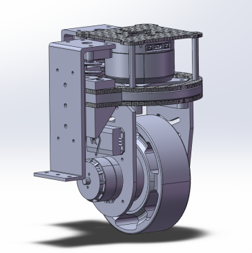

选择舵轮结构作为机器人的轮系，原因如下：

1. 舵轮相对于麦克纳姆轮来说质量更重，针对本赛季对于工程取矿的要求，更有利于降低重心；
2. 舵轮相对于传统的麦克纳姆轮，转向更灵活；
3. 在与其他车发生碰撞时，比起麦克纳姆轮，舵轮对于方向的掌控更为稳定。

缺点为每个轮子要比原来的麦轮多使用一个6020电机，增加了成本和调试时间。

### 2.2 云台

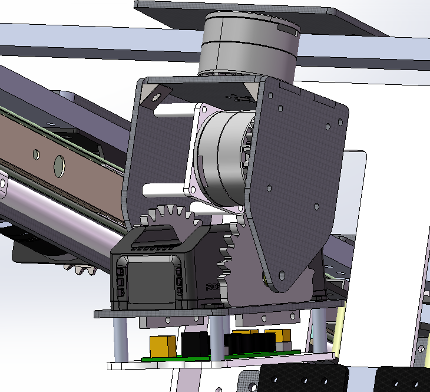

Yaw + Pitch 双轴云台

### 2.3 伸展变形结构

#### 2.3.1 抬升机构

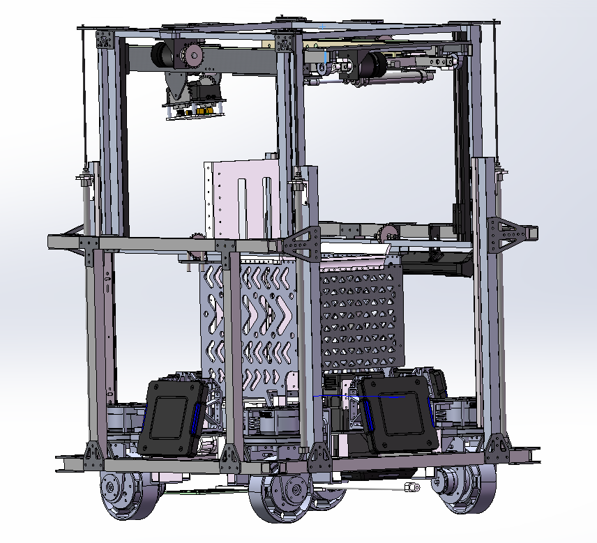

​	抬升设计为二段抬升，使得夹取机构能在 240mm 至 1000mm 间自由移动。第一段架子在内框抬升，抬升方式为链条传动，链条配合滑块实现抬升，优点是传动稳定，第二段内框抬升，抬升方式为气缸抬升，优点是抬升速度快，可配合传感器空接矿石。

#### 2.3.2 前伸机构

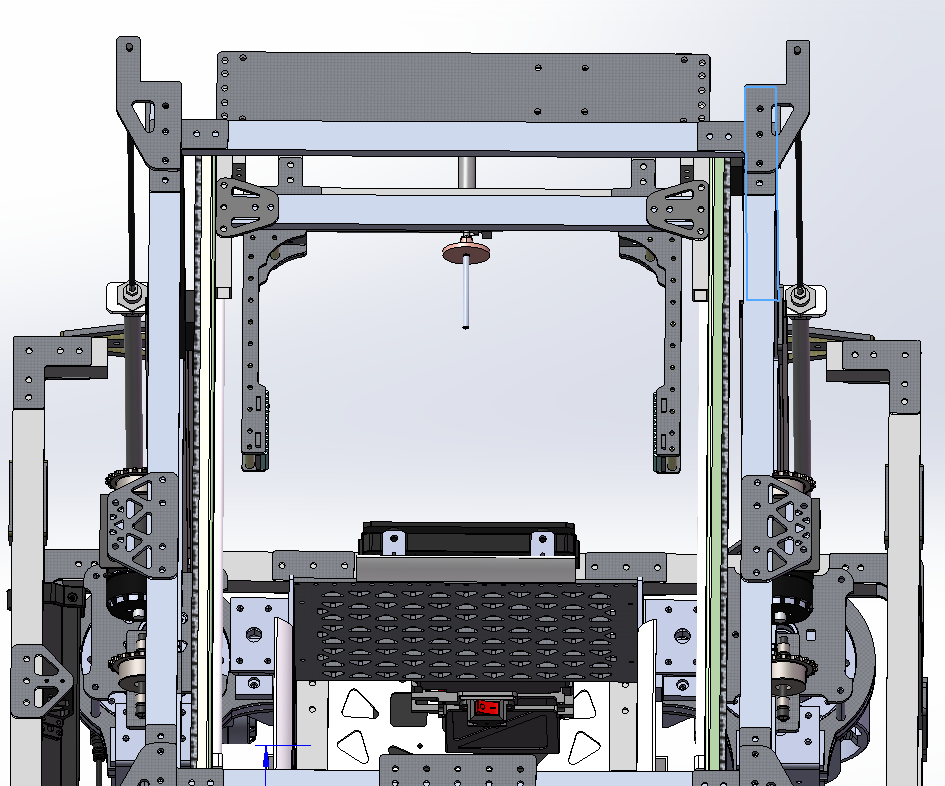

采用气缸 + 滑轨的组合实现夹爪前伸与回收。

#### 2.3.3 夹取机构（夹爪）

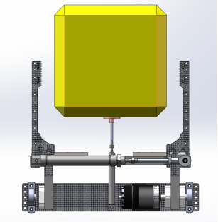

​	采用气缸和滑块组合，同时改进了夹爪形状，在减轻重量的同时不影响使用功能。为了提高兑换矿石效率，增加了推矿石的机构，在夹子成功夹取到矿石来到兑换站开启兑换模式的时候，当夹子带着矿石完成兑换，松开矿石的时候，气缸完成推出动作，将矿石推入收集槽中，整个兑换流程结束。

## 3. 硬件部分

### 3.1 主控板

**主控芯片：STM32F405**

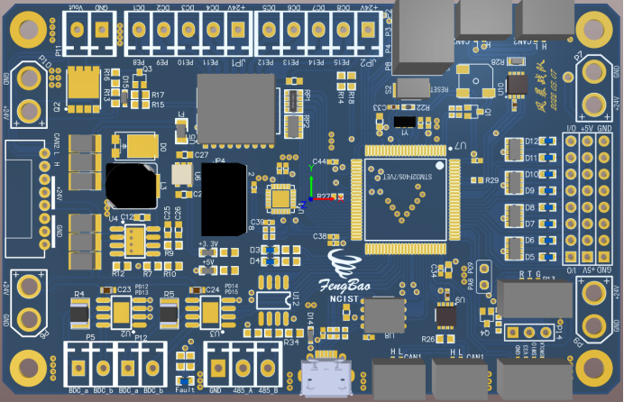

### 3.2 硬件连接拓扑图

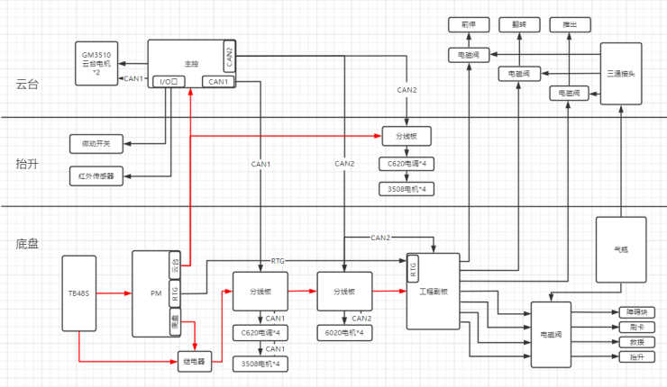

### 3.3 红外光电传感器

​	漫反射型光电开关是当开关发射光束时，目标产生漫反射，发射器和接收器构成单个的标准部件，当有足够的组合光返回接收器时，开关状态发生变化，作用距离的典型值一直到3米。特征：

1. 有效作用距离是由目标的反射能力决定，由目标表面性质和颜色决定；
2. 较小的装配开支，当开关由单个元件组成时，通常是可以达到粗定位；
3. 采用背景抑制功能调节测量距离；
4. 对目标上的灰尘敏感和对目标变化了的反射性能敏感。

## 4. 电控部分

### 4.1 主控制板

#### 4.1.1 主控制板功能定义

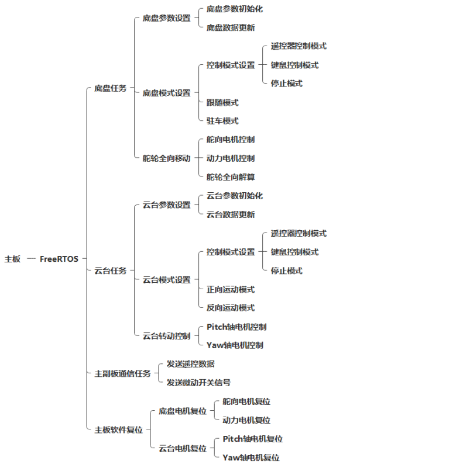

#### 4.1.2 运行测试

### 4.2 副控制板

#### 4.2.1 副控制板功能定义

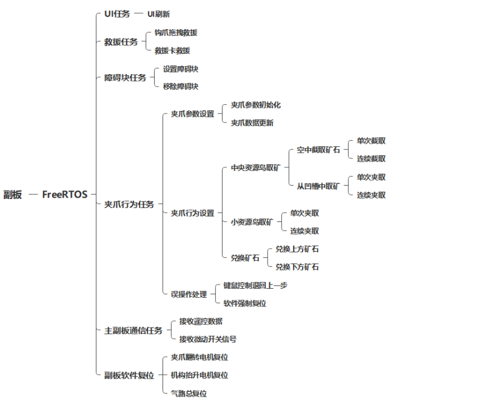

#### 4.2.2 运行测试

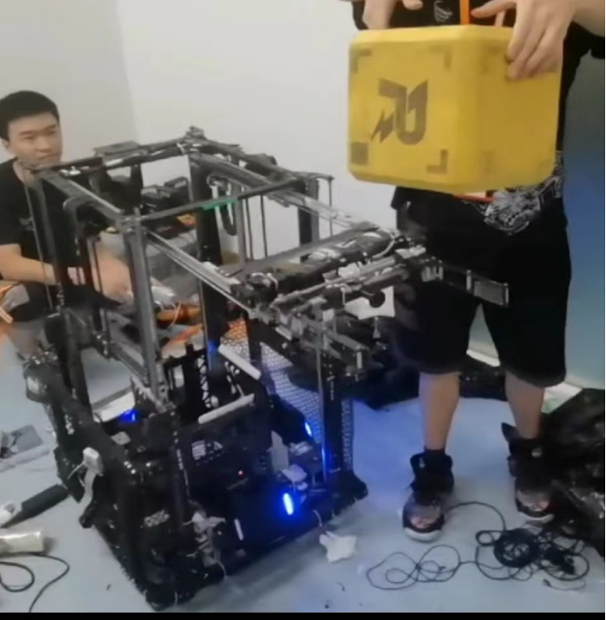

### 代码实现

​	具体代码已提交 github：

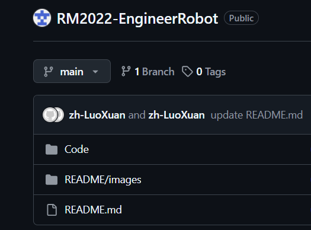

可点击下方链接跳转查看：

[RM2022工程代码](https://github.com/zh-LuoXuan/RM2022-EngineerRobot/tree/main/Code)

### 4.4 迭代记录

#### 4.4.1 主控制板迭代记录

| 版本号或阶段 | **版本备注**                                                 | **完成时间** |
| ------------ | :----------------------------------------------------------- | ------------ |
| **测试阶段** | 舵轮底盘基本移动，摸索舵轮的移动控制逻辑，BUG很多；          | 2022.05.29.  |
| **测试阶段** | 全向移动仅限于遥控器模式；                                   | 2022.05.31.  |
| **V1.0**     | 舵轮底盘融合全向算法，加入角度与速度融合算法；               | 2022.06.02.  |
| **V1.1**     | 基本功能初步实现；                                           | 2022.06.03.  |
| **V1.2**     | 加入调换车头正方向功能；                                     | 2022.06.08.  |
| **V1.3**     | 由于布线调整，向副板发送的数据中加入微动开关的数据，底盘加以限幅； | 2022.06.09.  |
| **V1.4**     | 加入模式切换，初步整理了代码；                               | 2022.06.09.  |
| **V1.5**     | 归中与疯车BUG解决，BUG具体体现在使用调头功能时，跟随状态不稳定，问题在于底盘云台分离或跟随的判断条件不合理； | 2022.06.11.  |
| **V1.6**     | 粗调基本完成；                                               | 2022.06.13.  |
| **V1.7**     | 代码测试，加入跟随死区（其目的是解决云台归中时数据振荡导致舵向电机乱打舵的问题，但效果不是很好）； | 2022.06.14.  |
| **V1.8**     | 解算完成，后期会继续对解算进行研究，以期达到期望效果；       | 2022.06.16.  |
| **V1.9**     | 调头功能完成，修正了斜坡用法，效果很明显；                   | 2022.06.17.  |
| **V2.0**     | 加入超慢速功能（采矿对位时用），全功能实现；                 | 2022.06.19.  |
| **V2.1**     | 最终版本，根据操作手习惯调整了控制按键；                     | 2022.06.20.  |

#### 4.4.2 副控制板迭代记录

| 版本号或阶段 | **版本备注**                                                 | **完成时间** |
| ------------ | :----------------------------------------------------------- | ------------ |
| **测试阶段** | BUG体现为电机有力但基本不运动；                              | 2022.06.06.  |
| **测试阶段** | BUG解决，问题在于函数斜坡函数累加，但电机控制函数只调用一次，故取消斜坡即可； | 2022.06.07.  |
| **测试阶段** | 初始化电机位置归中，由于3508不具有绝对角度编码器，而控制中运动行程固定，故需要软件归中并给予软件零点，但电机到位后剧烈发抖； | 2022.06.07.  |
| **V1.0**     | 复位采用角度累加控制，电机位置复位BUG暂时解决，BUG问题在于控制逻辑标志位与按键按下标志以及电机到达指定位置的顺序相冲突，导致停转条件和停转顺序难以达到预期； | 2022.06.08.  |
| **V1.1**     | 其中一个复位微动开关调整到主板；                             | 2022.06.09.  |
| **V1.2**     | 因为位置复位未完成无法进行其他功能的控制，为了适应临场紧急控制，加入临时紧急角度微调和强制退出位置初始化功能； | 2022.06.09.  |
| **V1.3**     | 矿石仓控制由电机控制改为气动控制，调整IO分配方案；           | 2022.06.09.  |
| **V1.4**     | 上车测试，优化控制，取消斜坡，上电有BUG，具体体现在上电后位置复位当即结束，但电机并未归中； | 2022.06.11.  |
| **V1.5**     | 上电不归中BUG解决，问题在于主板与副板上电顺序不固定，也解决了误触打断正在执行的任务转而进入其他任务的问题； | 2022.06.17.  |
| **V1.6**     | 加入静态UI，全功能实现；                                     | 2022.06.19.  |
| **V1.7**     | 根据操作手习惯调整按键分配，细化控制逻辑步骤，修改任务开关的写法； | 2022.06.20.  |
| **V1.8**     | 最终版本，稳定空接实现；                                     | 2022.06.24.  |

### 4.5 重点问题解决记录

| 序号   | **问题描述**                                                 | **问题产生原因**                                             | 问题解决方案 & 实际解决效果                                  | **对应版本号或阶段** |
| ------ | ------------------------------------------------------------ | ------------------------------------------------------------ | ------------------------------------------------------------ | -------------------- |
| **1**  | 电机反馈有数据也发送了控制指令，但是电机无控制响应           | 发送数据对应的数据位与电机ID不匹配                           | 调整发送的数据位后，电机可正常控制，效果理想                 | 测试版本             |
| **2**  | 全向移动算法能用，但只能在遥控器模式下使用，并不适用于键鼠控制模式，为设置底盘跟随状态软件数据接口 | 全向移动算法存在不足，考虑不全                               | 融合改良后的舵轮全向移动算法后，全向移动适用于所有模式且加入了跟随模式的软件数据接口 | V1.0                 |
| **3**  | 主副板通信只更新一次数据                                     | 主板使用操作系统向副板发送数据时只发送了一次数据，发送未在循环中 | 将发送数据置于循环中，问题得以解决，数据正常                 | V1.0                 |
| **4**  | 抬升电机与夹爪翻转电机在断电后会丢失归中值                   | 电机没有绝对值编码器                                         | 加上了微动开关用于反馈机器人相关机构复位信号                 | V1.0                 |
| **5**  | 在断电状态下与上电时，机器人气阀状态紊乱                     | 加上微动开关后，气阀所需信号与主控制板默认信号冲突           | 硬件改线，下拉默认电平信号                                   | V1.1                 |
| **6**  | 框架抬升太慢，下降时太快，对机械结构冲击太大                 | 气阀接口与气管口径过小导致进气太慢，气压不足而泄气太快       | 跟换大口径气阀接口与气管                                     | V1.1                 |
| **7**  | 运动过程中底盘舵向电机旋转角度过大                           | 全向算法仍然存在不足                                         | 优化全向移动算法                                             | V1.1                 |
| **8**  | 底盘跟随模式与调换车头模式在模式切换时底盘云台分离与再次跟随切换不流畅，切换成功概率随机 | 陀螺仪数据反馈与电机编码器数据反馈使用不当与车头调换成功判断条件不合理 | 重新整理数据流，调整车头调换成功判断条件后，能够顺利调换车头 | V1.2                 |
| **9**  | 气路工作时间与电机工作时间冲突，已损坏机器人结构             | 软件延时不恰当                                               | 调整软件延时                                                 | V1.2                 |
| **10** | 漫反射红外传感器返回数据错误，空中截取矿石功能执行紊乱       | 传感器接线错误，传感器放置位置不合适                         | 调整传感器线序与传感器放置位置后，空中截取功能实现，效果理想 | V1.3                 |
